# 1.3.3 Instalación de WordPress usando contenedores Docker y Docker Compose

#### Instalamos Docker y Docker Compose
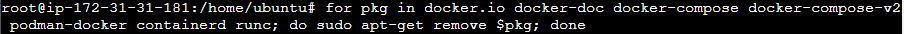
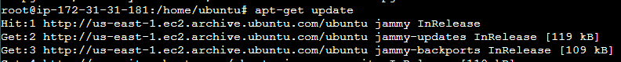
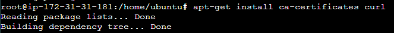

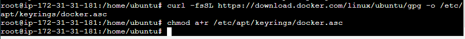
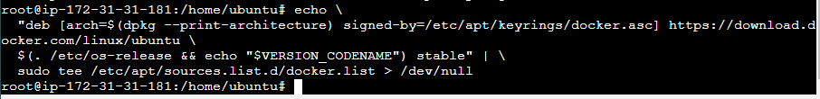
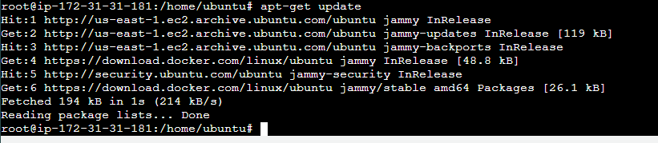
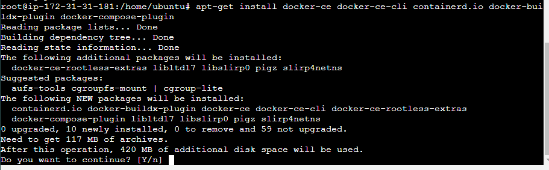
#### Comprobamos la version de Docker
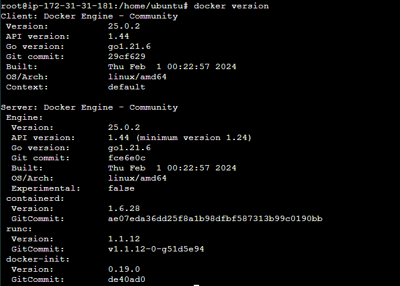
#### Lo probamos ejecutando hello world
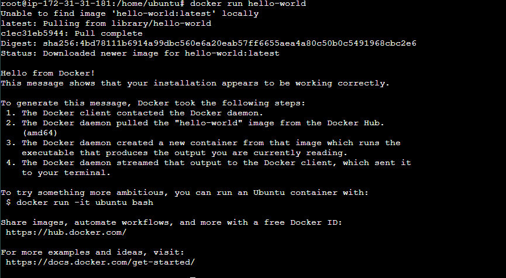
#### Comprobamos la version Docker Compose
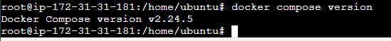
#### Agregamos el nuestro usuario al grupo DOCKER
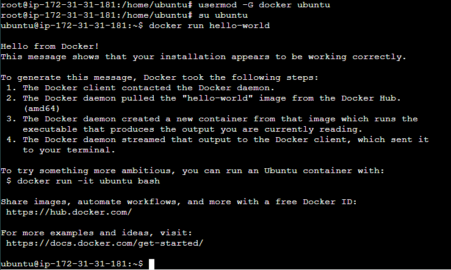
#### Instalamos GIT
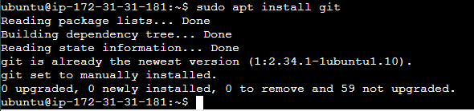
#### Hacemos un git clone del repositorio que contiene los .yml
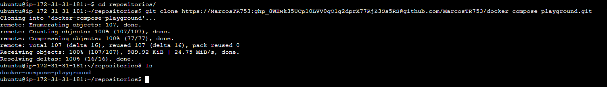
#### Ejecutamos el docker-compose.yml correspondiente
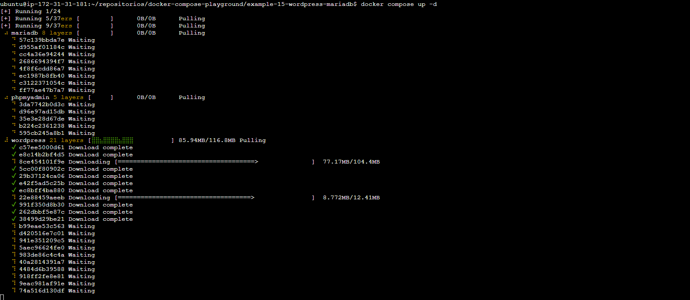
#### Comprobamos wordpress
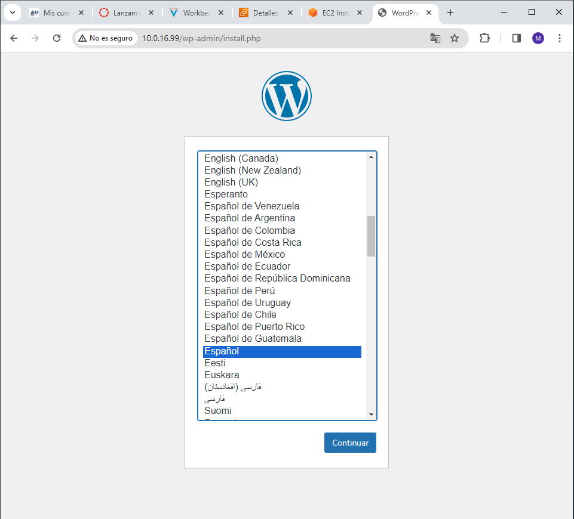
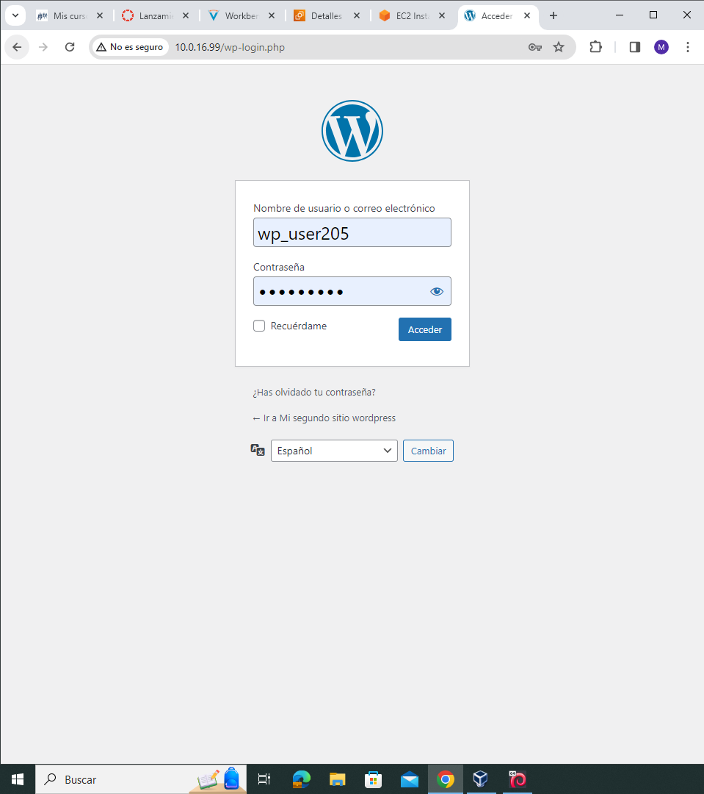

#### Contenido del docker-compose.yml

